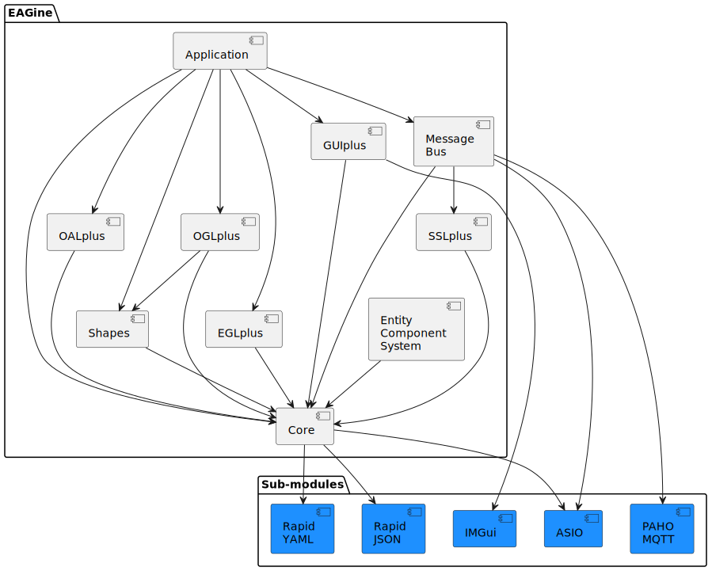

==========
EAGine All
==========

:Author: Matúš Chochlík <matus.chochlik@proton.me>

EAGine is a collection of C++ libraries providing set of basic utilities, C++
wrappers for OpenGL, OpenAL, EGL, SSL, and a message bus useful for writing
potentially distributed, multi-process applications with graphics rendering
and/or audio playback.

This is the main repository for the whole project and implements a build system
for the following sub-modules:

 * https://github.com/matus-chochlik/eagine-core
 * https://github.com/matus-chochlik/eagine-sslplus
 * https://github.com/matus-chochlik/eagine-msgbus
 * https://github.com/matus-chochlik/eagine-shapes
 * https://github.com/matus-chochlik/eagine-eglplus
 * https://github.com/matus-chochlik/eagine-oglplus
 * https://github.com/matus-chochlik/eagine-oalplus
 * https://github.com/matus-chochlik/eagine-ecs
 * https://github.com/matus-chochlik/eagine-app

This diagram shows the dependencies between the sub-modules:

Cloning the repo
================
::

 git clone https://github.com/matus-chochlik/eagine-all.git

Building the code
=================

The project uses `cmake`-based build system so you can use the following
to build and install the code:

::

  mkdir -p /path/to/build/dir
  cd /path/to/build/dir
  cmake -DCMAKE_BUILD_TYPE=Release \
        -DCMAKE_INSTALL_PREFIX=/path/to/install/dir \
        /path/to/eagine-all/
  cmake --build . --target install --parallel 16

License
=======

Copyright Matúš Chochlík, 2015-2024.
Distributed under the Boost Software License, Version 1.0.
See accompanying file LICENSE_1_0.txt or copy at
https://www.boost.org/LICENSE_1_0.txt

The applications using Qt5 are distributed under
the GNU GENERAL PUBLIC LICENSE version 3.
See http://www.gnu.org/licenses/gpl-3.0.txt

